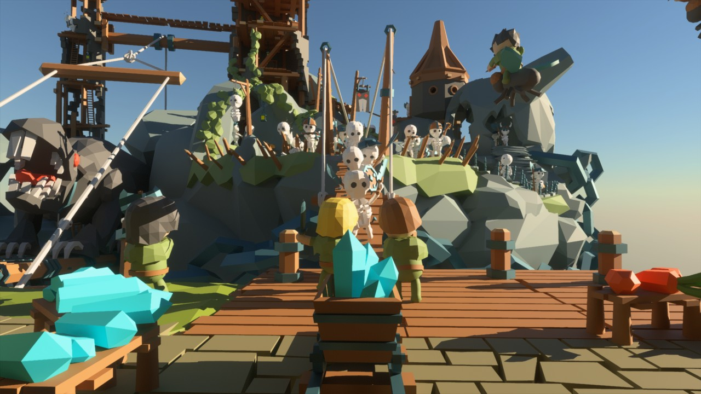

# 💡 kajiya

A real-time global illumination renderer; primarily a toy written for fun to explore various algorithms. Uses Vulkan with ray-tracing extensions under the hood.

Its general goal is to get as close as possible to path-traced reference at real-time rates in dynamic scenes, without any precomputed light transport, or manually placed light probes.

At the same time, `kajiya` does not aim to be a fully-featured renderer used to ship games, support all sorts of scenes, lighting phenomena, or a wide range of hardware. It's a hobby project, takes a lot of shortcuts, and is perpetually a work in progress.



## Features

* Hybrid rendering using a mixture of raster, compute, and ray-tracing
* Dynamic global illumination
    * Multi-bounce temporally-recurrent voxel-based diffuse
    * Short-range ray-traced diffuse for high-frequency details
    * Single bounce specular, falling back to diffuse after the first hit
* Sun with ray-traced soft shadows
* Standard PBR with GGX and roughness/metalness
    * Multi-scattering BRDF, energy-preserving metalness
* Reference path-tracing mode
* Physically-based rendering
* Temporal anti-aliasing
* Natural tone mapping
* Physically-based glare
* Basic motion blur
* Contrast-adaptive sharpening
* DLSS support
* GLTF mesh loading (no animations yet)
* A render graph running it all

Not actively used:

* Screen-space ambient occlusion (GTAO)
    * Currently plugged in as a cross-bilateral feature guide for GI denoising
* Screen-space diffuse bounce based on GTAO

Traces of code:

* Basic SDF sculpting and rendering

## Platforms

It currently works on a very limited number of systems and hardware.

Operating systems:
* Windows
* Linux

Hardware:
* Nvidia RTX cards
* Nvidia GTX 1060+ series (slow: driver-emulated ray-tracing)
* Radeon 6000+ _eventually_ - there are probably synchronization issues / bugs on AMD

## Building and running

There's a very minimal asset pipeline in `bake.rs`, which converts meshes from GLTF to an internal flat format, and calculates texture mips. In order to bake all the provided meshes, run:

* Windows: `bake.cmd`
* Linux: `./bake.sh`

When done, run the renderer demo via:

* Windows: `build_and_run.cmd [scene_name]`
* Linux: `./build_and_run.sh [scene_name]`

Where `[scene_name]` is one of the file names in `assets/scenes`, without the `.ron` extension, e.g.:

```
build_and_run.cmd battle
```

or

```
cargo run --bin view --release -- --scene battle --width 1920 --height 1080 --no-debug
```

_Please note that the `smol` async runtime is used for baking and run-time shader compilation. There's no custom executor yet, so the `SMOL_THREADS` environment variable controls parallelism._

## Adding Meshes and Scenes

To add new mesh(es), open `bake.cmd` (Win) / `bake.sh` (Linux), and add

* cargo run --bin bake --release -- --scene "[path]" --scale 1.0 -o [mesh_name]

To add new scenes, in `\assets\scenes`, create a `[scene_name].ron` with the following content:

```
(
    instances: [
        (
            position: (0, 0, 0),
            mesh: "[mesh_name]",
        ),
    ]
)
```

### Controls

* WSAD, QE - movement
* Mouse + RMB - rotate the camera
* Mouse + LMB - rotate the sun
* Shift - move faster
* Ctrl - move slower
* Space - switch to reference path tracing
* Backpace - reset reference path tracing accumulation
* Tab - show/hide the UI

## Known issues

* Vulkan API usage is extremely basic. Resources are usually not released, and barriers aren't optimal.
* There's a hard limit on mesh data and instance count. Exceeding those limits will result in Vulkan validation errors / driver crashes.
* Window (framebuffer) resizing is not implemented.
* The voxel GI uses a fixed-size volume around the origin. It will get cascades later.
    * Use `--gi-volume-scale` to change its extent in the `view` app
* Denoising needs more work (always).

## Using DLSS

DLSS is supported on Nvidia RTX GPUs, and `kajiya` can currently use it when running on Windows.

Nvidia's DLSS EULA prohibits distribution of the DLSS SDK, so you will have to obtain it yourself. The stand-alone SDK currently requires an NVIDIA Developer Program membership, _however_ the Unreal Enigine 5 plugin does not, yet it contains the necessary files.

Therefore, the easiest way to get DLSS into `kajiya` is to [download the UE5 DLSS plugin](https://developer.nvidia.com/dlss-getting-started#ue-version), and extract the necessary files:

* Copy `DLSS/Binaries/ThirdParty/Win64/nvngx_dlss.dll` to the root `kajiya` folder (where this README resides).
* Copy `DLSS/Source/ThirdParty/NGX` to `crates/lib/ngx_dlss/NGX`

When building `kajiya`, use the `dlss` Cargo feature, and specify temporal upsampling, e.g.:

```
cargo run --bin view --release --features dlss -- --scene battle --no-debug --temporal-upsampling 1.5 --width 1920 --height 1080
```

This will run DLSS _Quality_ mode. `--temporal-upsampling 2.0` corresponds to _Performance_.

Please note that while DLSS works well for AAA-style content, it currently struggles with flat colors and smooth gradients. The built-in `kajiya` TAA and its temporal upsampling tends to look better there.

## Acknowledgments

This project is made possible by the awesome open source Rust community, and benefits from too many crates to mention here. Special thanks go to:

* Felix Westin for his [MinimalAtmosphere](https://github.com/Fewes/MinimalAtmosphere), which this project uses for sky rendering
* AMD, especially Dominik Baumeister and Guillaume Boissé for the [FidelityFX Shadow Denoiser](https://gpuopen.com/fidelityfx-denoiser/), which forms the basis of shadow denoising in `kajiya`.
* Maik Klein for the Vulkan wrapper [ash](https://github.com/MaikKlein/ash), making it easy for `kajiya` to talk to the GPU.
* Traverse Research and Jasper Bekkers for a number of highly relevant crates:
  * Bindings to the DXC shader compiler: [hassle-rs](https://github.com/Traverse-Research/hassle-rs)
  * SPIR-V reflection utilities: [rspirv-reflect](https://github.com/Traverse-Research/rspirv-reflect)
  * Vulkan memory management: [gpu-allocator](https://github.com/Traverse-Research/gpu-allocator)
  * Blue noise sampling: [blue-noise-sampler](https://github.com/Jasper-Bekkers/blue-noise-sampler)
